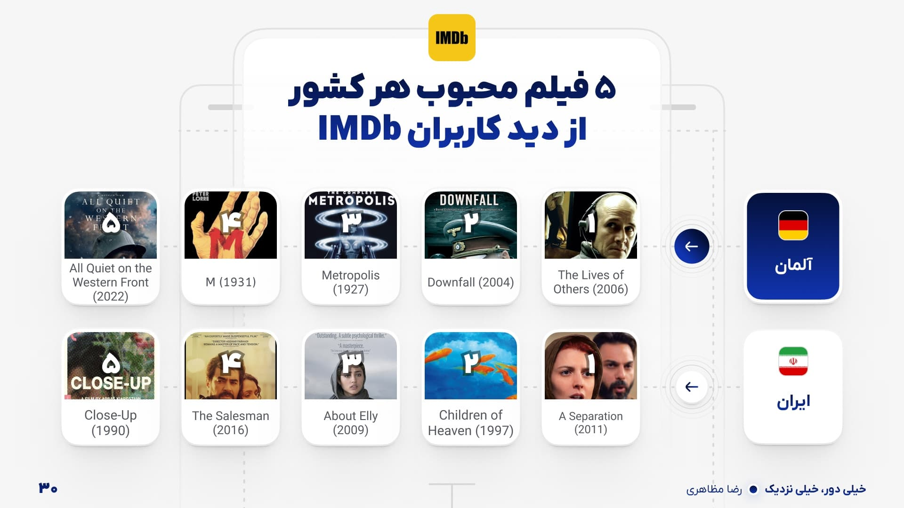

# خیلی دور، خیلی نزدیک
## فهرست  

- [اگه می‌خوای بدونی چرا این پروژه استارت خورد از اینجا شروع کن به خوندن](#مقدمه)
- [اگه دنبال نتایج به دست اومده‌ای از اینجا](#نتایج)
- [اگه دوست داری بدونی من چجوری به این نتایج رسیدم از این لینک](#روش)  

## چکیده  

در این پروژه به این سوال پاسخ داده شده که سلیقه‌ی بینندگان ایرانی تا چه اندازه با سلیقه‌ی بینندگان جهانی شباهت دارد:

- بیش از ۶٬۶۵۰ فیلم با ۲۲ ویژگی متفاوت بررسی شد
- از میانگین بیزی (Bayesian Average) برای رتبه‌بندی منصفانه‌ی فیلم‌ها، کارگردان‌ها، نویسنده‌ها و بازیگران استفاده شد
- ده‌ها یافته‌ی جذاب استخراج شد: از محبوب‌ترین فیلم‌ها گرفته تا محبوب‌ترین کشورهای سازنده‌ی فیلم به غیر از هالییوود و تاثیر بودجه بر محبوبیت فیلم‌ها
- یافته‌ی اصلی: اگر یک فیلم مورد پسند کاربران جهانی باشد، تنها ۵۳٪ احتمال دارد که مورد پسند کاربران ایرانی هم قرار بگیرد — همبستگی سلیقه‌ها ضعیف است (اسپیرمن ۰.۴۰۷)  

## ابزارهای مورد استفاده (Tech Stack)

**Data Collection**

**Data Processing & Analysis**

**Visualization**

**Environment**

## مقدمه
پروژه‌ی خیلی دور خیلی نزدیک، پروژه‌ی تحلیل تفاوت سلیقه‌ی سینمایی دو دسته از کاربران می‌باشد، کاربران ایرانیِ دوتا از وبسایت‌های معروف دانلود فیلم و سریال و کاربران وبسایت IMDb.
اگر شما هم خود را عضوی از جامعه‌ی فیلمبازان می‌دانید، مطمئنا برایتان پیش آمده که هنگام انتخاب یک فیلم برای تماشا، به امتیاز IMDb آن اعتماد کنید یا برای قانع کردن دوستتان برای تماشای یک اثر، از امتیاز IMDb آن به عنوان مرجع استفاده کنید. حتما شما هم در موارد بسیاری شاهد اختلاف نظر خود و دوستانتان با این عدد بوده‌اید. **اگر شما هم فیلم‌هایی در ذهن دارید که معتقدید لایق امتیاز IMDb بالاتری هستند یا به عکس، فیلمی دیده‌اید که به اندازه‌ی امتیازش نظرتان را جلب نکرده، این پروژه برای شماست**.  

هدف از انجام این پروژه، پاسخ به این سوال است که **سلیقه‌ی بینندگان ایرانی، تا چه اندازه به سلیقه‌ی بینندگان جهانی شباهت دارد**، آیا تفاوت فرهنگی این دو دسته از کاربران در محبوبیت آثار سینمایی از نگاه آنان موثر است؟ یا به عبارت دیگر، برای تماشای یک فیلم به امتیاز IMDb آن باید توجه بیشتری کنیم یا امتیاز کاربران ایرانیِ وبسایت‌های دانلود فیلم و سریال؟  

پاسخ به این سوال، چه مثبت باشد و چه منفی، ما را به بازبینی عنوان‌ها و افرادی وادار می‌کند که با آن‌ها در طول سال‌ها خاطره ساخته‌ایم، در مورد آن‌ها بحث کرده و نگاه آنان را نقد کرده‌ایم. علاوه بر این، یافته‌های این پروژه می‌تواند به انتخاب فیلم‌هایی منجر شود که تجربه‌ای غنی‌تر و لذت‌بخش‌تر از هنر هفتم را ارائه دهند همچنین کنجکاوی ما را نسبت به تاثیر تفاوت‌های فرهنگی بر سلیقه سینمایی پاسخ دهد.

لینکدین من: [لینک](https://www.linkedin.com/in/rezaa-mzk/)  
## هشدار
پروژه‌ای که در ادامه می‌بینید بر اساس مجموعه‌ی دادگانی تهیه شده که از دو وبسایت‌ شناخته شده‌ی دانلود فیلم و سریال ایرانی به دست آمده و به کمک وبسایت IMDb تکمیل شده است. در شروع پروژه تلاش شد که وبسایت‌هایی که قرار است در اینجا نماینده‌ی نظر و سلایق ایرانیان باشند، از وبسایت‌های پرطرفدار و شناخته شده در جامعه‌ی فیلمبازان ایرانی انتخاب گردند. با این حال توجّه به این نکته ضروری است که این‌جا فقط فیلم‌هایی در ترازوی تحلیل قرار گرفتند که در هر دو وبسایت امکان دانلود آن‌ها فراهم بوده است.  

از طرف دیگر، متاسفانه با توجه به مسدود شدن پی‌درپی رسانه‌های آزاد دانلود فیلم و سریال، حجم کثیری از دادگان ما کاربران ایرانی از دست می‌رود، برای مثال بسیاری از ما، فیلم‌هایی را از وبسایت «تاینی موویز» دانلود و مشاهده کردیم، امتیاز و نظر دادیم که بعد از بسته شدن آن رسانه دوباره به ثبت امتیاز و نظر درباره‌ی آن‌ها نپرداختیم. **واضح است که این از دست رفتن دادگان، می‌تواند نتایج به دست آمده را تا حدی غیر قابل اعتماد کند**، با این حال تلاش در این‌جا بر این بوده که با آنچه در اختیار داریم، یک تحلیل عادلانه انجام گردد و به سوال‌های مطرح شده پاسخ داده شود.  

> در طول این پروژه فقط فیلم‌هایی در ترازوی تحلیل قرار گرفتند که در هر دو وبسایت دانلود فیلم و سریال که برای انجام این پروژه انتخاب شدند، امکان دانلودشان فراهم بوده است.

در ادامه، این نوشته به دو بخش تقسیم می‌گردد: بخش اول با عنوان «نتایج» یافته‌های حاصل از تحلیل را ارائه می‌دهد و بخش دوم با عنوان «شیوه‌ی پژوهش» به بررسی پیاده‌سازی‌های فنی و روش‌شناسی پروژه می‌پردازد.  

## نتایج  

### ۱۰ فیلم برتر

  

  

### ۱۰ فیلم با بیشترین تعداد نظر (کامنت)

در این قسمت فیلم‌هایی را می‌بینیم که درباره‌ی آن‌ها بیشترین تعداد نظر (کامنت) به ثبت رسیده است. اشاره به این موضوع که در اینجا فقط تعداد نظرها مورد بررسی بوده نه مثبت و منفی بودن آن‌ها، حائز اهمیت است.  

  

> در میان ۱۰ فیلم پربحث و نظر از طرف کاربران IMDb، چهار فیلم درباره شخصیت‌های کامیک دنیای DC، سه فیلم درباره شخصیت‌های کامیک دنیای Marvel و دو فیلم بر اساس رمان ساخته شده‌اند.  
این فهرست شامل فیلم‌هایی است که در رسانه‌های نقد فیلم توسط منتقدان حرفه‌ای همچون نیویورک تایمز، رولینگ استون و ... بیشترین تعداد نقد را دریافت کرده‌اند.

### ۱۰ فیلم با بیشترین تعداد نقد حرفه‌ای

این فهرست شامل فیلم‌هایی است که در رسانه‌های نقد فیلم توسط منتقدان حرفه‌ای همچون نیویورک تایمز، رولینگ استون و ... بیشترین تعداد نقد را دریافت کرده‌اند.  

  

### تحلیل تفاوت و شباهت سلیقه‌ی سینمایی ایرانیان و کاربران IMDb  

این بخش را به چهار قسمت تقسیم می‌کنیم که دو بخش نخست به شباهت‌های سلیقه و دو بخش پایانی به تفاوت‌های سلیقه اختصاص یافته است:  

> از بین فیلم‌های مجموعه داده‌ی در دست، ۱۳ درصد را هر دو گروه پسندیدند و ۸ درصد را هیچ کدام از دو گروه دوست نداشتند، ۴ درصد از فیلم‌ها را کاربران ایرانی دوست داشتند و کاربران وبسایت IMDb خیر، همچنین ۲ درصد از فیلم‌ها را کاربران IMDb دوست داشتند اما کاربران ایرانی خیر.  

- بخش نخست شامل فیلم‌هایی است که هر دو گروه کاربران آن‌ها را دوست داشتند و درباره امتیازشان توافق نظر داشتند.  

  

- بخش دوم شامل فیلم‌هایی است که هر دو گروه کاربران درباره کیفیت پایین آن‌ها توافق داشتند و هیچ‌کدام آن‌ها را نپسندیدند.  

> شاید جالب باشد بدانید که نقش بتمن/بروس وین را در فیلم بتمن و رابین ((1997) Batman & Robin) جورج کلونی بازی می‌کند.  

- بخش سوم شامل فیلم‌هایی است که کاربران IMDb آن‌ها را پسندیدند، اما در فهرست مورد علاقه‌ی کاربران ایرانی جای نگرفتند.

- بخش چهارم شامل فیلم‌هایی است که کاربران ایرانی آن‌ها را پسندیدند، اما کاربران IMDb نظر مساعدی به آن‌ها نداشتند.  

> یک حقیقت جالب (Fun Fact) درباره فیلم «اراگون» (Eragon 2006): این فیلم بر اساس مجموعه رمان چهارجلدی «حلقه‌ی وراثت» (The Inheritance Cycle) نوشته‌ی کریستوفر پائولینی (Christopher Paolini) ساخته شده است. انتقاد اصلی به فیلم درباره نحوه‌ی اقتباس از کتاب است؛ منتقدان آن را تقلیدی از «جنگ ستارگان» در دنیای «ارباب حلقه‌ها» می‌دانند. کاربران عادی نیز معتقدند این فیلم به دلیل کوتاه بودن، نمی‌تواند داستان کتاب را به خوبی منتقل کند. با این حال، در سال ۲۰۲۰ کمپانی دیزنی که صاحب حقوق معنوی اثر است، تصمیم گرفت تا یک نسخه‌ی (Live Action) در بستر دیزنی پلاس (Disney Plus) برای این مجموعه رمان تولید کند.  

### برترین کارگردانان  

  

  

### برترین نویسندگان  

  

  

### محبوب‌ترین بازیگران  

  

  

  

  

> در بین بازیگران معرفی شده به عنوان بازیگران محبوب تنها دو بازیگر رنگین پوست حضور دارند، Morgan Freeman و Zoe Saldana  

### محبوب‌ترین ژانر‌ها  

  

### تاثیر بودجه‌ی ساخت بر محبوبیت فیلم  

در نمودار پایین محور افقی (xها) نشانگر بودجه‌ی ساخت فیلم و محور عمودی نشانگر میانگین امتیاز داده شده به وسیله‌ی کاربران و به مجموعه‌ی آن فیلم‌ها می‌باشد. رنگ سفید در این نمودار مشخص کننده‌ی کاربران ایرانی و رنگ آبی مشخص ‌کننده‌ی کاربران وبسایت IMDb می‌باشد. تمام فیلم‌های موجود در مجموعه‌ی دادگان به پنج دسته‌ی بسیار کم، کم، متعادل، زیاد و خیلی زیاد تقسیم شده‌اند. واضح است که **کاربران ایرانی با زیاد‌تر شدن بودجه‌ی ساخت فیلم امتیاز بهتری به آن داده‌اند**. این رابطه برای کاربران وبسایت IMDb به این اندازه مستقیم نیست.

  

### محبوب‌ترین کشور‌های به جز هالیوود  

  

### محبوب‌ترین فیلم‌های کشورهای محبوب :)  

  

  

  

> از ۵ فیلم محبوب کاربران ایرانی از کشور دانمارک ۴تا در ۵ سال گذشته ساخته شده‌اند.  

  

 

  

> فیلم شماره‌ی سه «The Girl with the Dragon Tattoo»، دو سال قبل از نسخه‌ی هالیوودی آن با همین نام و با بازی Daniel Craig منتشر شده است.  

### سخن پایانی  

حال که به انتهای این سفر رسیده‌ایم، شاید بتوانیم با اطمینان بیشتری به سؤال اصلی‌مان پاسخ دهیم: آیا می‌توان به امتیاز IMDb به عنوان معیاری قطعی برای انتخاب فیلم اعتماد کرد؟  
تحلیل‌های آماری انجام شده نشان می‌دهد که پاسخ چندان ساده نیست. بررسی‌های من آشکار می‌کند که **حتی اگر فیلمی در IMDb امتیاز بالایی داشته باشد، تنها ۵۳ درصد احتمال دارد که مورد پسند مخاطبان ایرانی قرار گیرد**. این عدد به خوبی نشان می‌دهد که چرا گاهی با دیدن فیلم‌های پرامتیاز IMDb، احساس رضایت چندانی نمی‌کنیم.  

این فاصله در سلیقه با معیارهای علمی دیگر نیز قابل تایید است. تحلیل همبستگی بین امتیازهای کاربران ایرانی و IMDb، ارتباطی نسبتاً ضعیف را نشان می‌دهد. **ضریب همبستگی اسپیرمن ۰/۴۰۷ و معیار کندال تاو ۰/۲۸۶ (با p-value‌ی به اندازه‌ی ۰/۰۰ برای هر دو معیار) به ما می‌گوید که اگرچه سلیقه‌ی ما با مخاطبان جهانی بی‌ارتباط نیست، اما شباهت چشمگیری هم ندارد**.  

شاید بهتر باشد از این پس، در کنار توجه به امتیاز IMDb، نگاهی هم به نظرات هم‌وطنان خود بیندازیم و با ترکیبی از این دو دیدگاه، انتخاب‌های آگاهانه‌تری داشته باشیم. در نهایت، این تفاوت سلیقه نه تنها نقطه‌ی ضعف نیست، بلکه نشان‌دهنده‌ی غنای فرهنگی و تنوع دیدگاه‌های ما در دنیای پهناور سینماست.  

### ۲۵۰ عنوان برتر به انتخاب کاربران ایرانی  

برای طولانی نشدن این محتوی می‌تونید ۲۵۰ فیلمی که از کاربران ایرانی بالاترین امتیاز را دریافت کردند در این فایل ببینید.
[۲۵۰ عنوان برتر به انتخاب کاربران ایرانی](./iranian_top_250_movies.txt)

> در میان ۲۵۰ عنوان برتر به انتخاب کاربران ایرانی، ۲۰ فیلم ساخته شده در سال ۲۰۲۳، ۱۹ فیلم از سال ۲۰۲۲ و ۱۷ فیلم هم از سال ۲۰۱۶ وجود دارند. همچنین یک فیلم از سال ۱۹۴۶ و تنها پنج فیلم از سال ۲۰۲۴ در این دسته بندی قرار دارند.  

## روش  

مجموعه‌ی دادگان این پژوهش از دو منبع اصلی استخراج شده است:  

الف) دو وب‌سایت ایرانیِ دانلود فیلم و سریال  
ب) وب‌سایت IMDb

در این فرآیند، اطلاعات فیلم‌های هر دو وب‌سایت ایرانی (شامل امتیاز فیلم، تعداد رای‌دهندگان و تعداد نظرات) استخراج شد و فهرست فیلم‌های مشترک میان آن‌ها شناسایی گردید. سپس، داده‌های این فیلم‌ها با اطلاعات موجود در وب‌سایت IMDb (مانند سال تولید، بازیگران، بودجه‌ی ساخت، امتیاز، تعداد رای‌دهندگان و ... ) تکمیل شد.

### نرمال سازی  

یکی از چالش‌های اساسی در فرآیند تحلیل داده‌ها، تفاوت در سیستم امتیازدهی در سه منبع مورد استفاده بود. دو وب‌سایت از مقیاس ۱ تا ۱۰ و یکی از مقیاس ۱ تا ۵ استفاده می‌کردند که این تفاوت، مقایسه‌‌ی امتیازها را ناممکن می‌ساخت. برای حل این مسئله و قرار دادن تمام امتیازها در یک بازه‌ی مشخص می‌توان از روش‌های نرمال‌سازی همانند Min-Max Scaler و Z-Score بهره گرفت.  

مجموعه‌ی دادگان مرتبط با فیلم‌ها از هر منبعی که استخراج شده باشند دارای تعداد زیادی داده‌ی پرت هستند؛ به طوری که شمار محدودی از فیلم‌ها که بسیار شناخته شده‌ هستند تعداد رای‌دهندگان بسیار بالایی دارند، درحالی که اکثریت فیلم‌ها تعداد رای‌دهندگان بسیار کمتری دارند. به عنوان مثال، در وب‌سایت IMDb فیلم «رستگاری در شاوشنک» (The Shawshank Redemption) دارای سه میلیون رای دهنده است، درحالی که میانه‌ی تعداد رای دهندگان در این وبسایت حدود ۴۴ هزار نفر می‌باشد. در این شرایط استفاده از نرمال ساز Min-Max منجر به فشرده شدن محدوده‌ی داده‌ها می‌شود و ترند‌ها (Trends) بسیار کمرنگ می‌گردند. بنابراین، در این پروژه از نرمال‌ساز Z-‌Score یا Standard Scaler استفاده شده است تا داده‌ها تراز شده و تفاوت‌های آماری به وضوح آشکار گردد.  

### رتبه بندی  

چالش مهم دیگر این پژوهش،نحوه‌ی رتبه‌بندی فیلم‌ها بود. اگر فیلم‌ها صرفاً بر اساس میانگین امتیاز کاربران مرتب شوند، آثاری با امتیاز بالا (مثلاً ۱۰) اما تعداد رأی‌دهندگان کم (مثلاً ۲ نفر) در صدر جدول قرار می‌گیرند – مشکلی که در بسیاری از وب‌سایت‌های دانلود فیلم و سریال هنگام مرتب‌سازی بر اساس محبوبیت کاربران دیده می‌شود–. این در حالی است که تعداد افرادی که به یک فیلم امتیاز دادند باید به عنوان فاکتوری برای محبوبیت آن در نظر گرفته شود. برای حل این مشکل، از میانگین بیزی یا امتیاز وزن‌دار استفاده می‌شود، روشی که با در نظر گرفتن همزمانِ تعداد آرا و امتیاز فیلم، رتبه‌بندی منصفانه‌تری ارائه می‌دهد.  

> از میانگین بیزی برای حل مشکل تصاحب صدر جدول فیلم‌های برتر توسط فیلم‌هایی با امتیاز بالا و تعداد رأی کم استفاده می‌شود.  

$$
\text{Weighted Rating (WR)} =
\frac{v}{v+m} \cdot R +
\frac{m}{v+m} \cdot C
$$  

- R: (امتیاز فیلم) میانگین امتیاز کاربران به فیلم
- v: تعداد رأی دهندگان
- C: میانگین امتیاز همه‌ی فیلم‌های موجود در مجموعه داده
- m: حداقل تعداد آرای لازم برای تأثیرگذاری (Threshold)  

در این پروژه، امتیاز وزن‌دار به ازای هر فیلم و برای هر سه پلتفرم (دو ایرانی و IMDb) محاسبه شده است. در عملیات محاسبه، نحوه‌ی یافتن همه‌ی متغیرها به‌جز m مشخص است. برای تعیین m، از یک روش آماری مقاوم (Robust) استفاده شده است. این مقدار با محاسبه‌ی سه معیار مختلف و گرفتن میانه‌ی آن‌ها به‌دست می‌آید. این سه معیار عبارت‌اند از: محدوده‌ی میان‌چارکی (IQR)، میانگین به‌علاوه‌ی انحراف معیار (Mean + Standard Deviation) و صدک هفتاد و پنجم (75th Percentile).  

$$
m = \text{Median}(Q_3 + 1.5 \times (Q_3 - Q_1),\, \mu + \sigma,\, P_{75})
$$

- Q1 = چارک اول داده‌ها (25th percentile)
- Q3 = چارک سوم داده‌ها (75th percentile)
- Q3+1.5×(Q3−Q1) = روش محدوده‌ی میان‌چارکی (IQR)
- μ+σ = میانگین داده‌ها به‌علاوه‌ی انحراف معیار
- P₇₅​ = صدک هفتاد و پنجم داده‌ها
- Median(⋅) = میانه‌ی این سه مقدار  

پس از محاسبه‌ی امتیازهای وزن‌دار هر فیلم، لازم است امتیازات به‌دست‌آمده از دو رسانه‌ی ایرانی را ترکیب کنیم تا به معیاری واحد برای رتبه‌بندی فیلم‌ها برسیم. همان‌طور که پیش‌تر نیز بیان شد، تعداد رأی‌دهندگان به یک فیلم باید به‌عنوان عاملی تأثیرگذار در رتبه‌بندی آن در نظر گرفته شود. این اصل در ترکیب امتیازات دو رسانه نیز برقرار است، چراکه هرچه تعداد رأی‌ها بیشتر باشد، اطمینان به صحت امتیاز محاسبه‌شده افزایش می‌یابد.  

برای محاسبه‌ی ضریب اطمینان هر امتیاز، ابتدا سهم هر پلتفرم ایرانی را نسبت به کل رأی‌های ثبت‌شده توسط کاربران ایرانی در تمامی فیلم‌ها محاسبه می‌کنیم. سپس، این سهم به‌عنوان یک ضریب وزنی در ترکیب امتیازات دو رسانه‌ی ایرانی به کار گرفته می‌شود تا میزان تأثیر هر رسانه متناسب با تعداد رأی‌های آن تعیین شود.  

$$
W_{\mathrm{Iran\_1}} =
\frac{\mathrm{Total\ votes}_{\mathrm{Iran\_1}}}
{\mathrm{Total\ votes}_{\mathrm{Iran\_1}} + \mathrm{Total\ votes}_{\mathrm{Iran\_2}}},
\qquad
W_{\mathrm{Iran\_2}} =
\frac{\mathrm{Total\ votes}_{\mathrm{Iran\_2}}}
{\mathrm{Total\ votes}_{\mathrm{Iran\_1}} + \mathrm{Total\ votes}_{\mathrm{Iran\_2}}}
$$  

$$
W_{\mathrm{Iran\_combined}} =
W_{\mathrm{Iran\_1}} \times WR_{\mathrm{Iran\_1}}
+
W_{\mathrm{Iran\_2}} \times WR_{\mathrm{Iran\_2}}
$$  

در نهایت، از این امتیاز وزن‌دار محاسبه شده در بالا برای رتبه‌بندی فیلم‌ها مطابق با سلیقه‌ی کاربران ایرانی و از امتیاز وزن‌دار IMDb برای رتبه‌بندی فیلم‌ها بر اساس دیدگاه کاربران این وب‌سایت استفاده می‌شود.  

### تحلیل تفاوت و شباهت سلیقه‌ی سینمایی ایرانیان و کاربران IMDb  

به منظور تحلیل تفاوت‌ها و شباهت‌های سلیقه‌ی این دو گروه از کاربران در حوزه‌ی سینما، فیلم‌ها را به پنج دسته تقسیم می‌کنیم:  

- فیلم‌هایی که هر دو گروه دوست داشتند:
این فیلم‌ها امتیاز بالاتر از صدک ۷۵ام را از هر دو گروه کاربران دریافت کرده‌اند.
- فیلم‌هایی که کاربران ایرانی دوست داشتند اما کاربران IMDb خیر
این فیلم‌ها از کاربران ایرانی امتیاز بالای صدک ۷۵ام و از کاربران IMDb امتیاز پایین‌تر از صدک ۲۵ام را دریافت کرده‌اند.
- فیلم‌هایی که کاربران IMDb دوست داشتند اما کاربران ایرانی خیر
این فیلم‌ها از کاربران IMDb امتیاز بالای صدک ۷۵ام و از کاربران ایرانی امتیاز پایین‌تر از صدک ۲۵ام را دریافت کرده‌اند.
- فیلم‌هایی که مورد علاقه‌ی هیچ گروهی نبودند
این فیلم‌ها از هر دو گروه امتیاز پایین‌تر از صدک ۲۵ام را دریافت کرده‌اند.
- فیلم‌های خنثی
فیلم‌هایی که در هیچ‌کدام از دسته‌های بالا قرار نمی‌گیرند.  

پس از دسته‌بندی فیلم‌ها در این پنج گروه، برای هر فیلم قدرمطلق تفاضل امتیاز وزن‌دار IMDb و کاربران ایرانی و مجموع امتیاز کاربران IMDb و ایرانی محاسبه شده است. این دو مقدار در متغیرهای جدید ذخیره شدند و به‌عنوان معیار اصلی رتبه‌بندی فیلم‌ها در این بخش استفاده گردیدند.  

### تحلیل کارگردانان محبوب  

مشکلی که درباره فیلم‌های با امتیاز بالا و تعداد رأی‌دهنده‌ی کم داشتیم، در این حوزه نیز می‌تواند مشکل‌ساز باشد. در صورت رتبه‌بندی کارگردانان تنها بر اساس میانگین امتیاز ساخته‌هایشان، کارگردانانی که تعداد فیلم‌های کمتری با امتیازات نسبتاً خوب دارند، رتبه‌های بالا را به خود اختصاص می‌دهند. از این رو در رتبه‌بندی کارگردانان نیز، همانند رتبه‌بندی فیلم‌ها، از امتیاز وزن‌دار استفاده می‌کنیم تا رتبه بندی عادلانه‌تری داشته باشیم.  

$$ \text{Bayesian Average} = \frac{n}{n+m} \cdot \text{Mean Rating} + \frac{m}{n+m} \cdot C $$  

- n: تعداد فیلم‌های هر کارگردان
- m: آستانه‌ی اهمیت میانگین کل فیلم‌های مجموعه داده
- C: میانه‌ی کل امتیاز‌های مجموعه داده
- Mean Rating: میانگین امتیاز فیلم‌های هر کارگردان  

در اینجا نیز برای محاسبه‌ی m (حد آستانه‌ی اهمیت) از همان روش آماری مقاومی که پیش‌تر توضیح داده شد، استفاده شده است. گفتنی است که تحلیل نویسندگان برتر نیز از همین تکنیک کارگردانان و قطعه کد استفاده می‌کند.  

### تحلیل محبوبیت بازیگران  

برای بررسی محبوبیت بازیگران، آنچه در این پروژه در دست داریم، محبوبیت فیلم‌هایی است که در آن‌ها به ایفای نقش پرداخته‌اند؛ اما برخلاف نویسندگان و کارگردانان که در صورت همکاری در یک فیلم، مشارکتشان هم‌اندازه تلقی می‌شود، افرادی که نامشان در ابتدای فهرست بازیگران هر فیلم ذکر می‌شود، نقش مهم‌تری را در آن فیلم به پردۀ نقره‌ای آورده‌اند. به منظور ترکیب میزان اهمیت هر فرد در فیلم و میزان محبوبیت خودِ فیلم، از تکنیک Weight Decay استفاده می‌کنیم.  

یک فیلم خاص را در نظر بگیرید، اگر متغیر Weight Decay را ۰/۹ در نظر بگیریم نفر اول فهرست بازیگران وزن ۱، نفر دوم ۰/۹، نفر سوم ۰/۸۱، نفر چهارم ۰/۷۲۹ و الی آخر را خواهند داشت. این عدد را وزن بازیگر مذکور در فیلم مورد بررسی می‌نامیم.

$$\text{Weight} = (\text{Weight Decay})^{\text{Index of actor's name in cast}}$$  

حال که وزن هر بازیگر را در دست داریم، به منظور محاسبه‌ی نسبت مشارکت بازیگر در موفقیت یا عدم موفقیت فیلم، هر وزن را بر مجموع اوزان بازیگران آن فیلم تقسیم می‌کنیم تا عددی بین ۰ و ۱ به دست آید.

$$\text{Participation Weight} = \frac{\text{Weight}}{\sum \text{Weight}}$$

سپس عدد به دست آمده را در امتیاز وزن دار آن فیلم ضرب می‌کنیم تا سهم هر بازیگر از محبوبیت یا عدم محبوبیت فیلم مشخص شود.

$$\text{Actor Contribution}=\text{Movie's Weighted Rate}\times\text{Participation Weight}$$

در نهایت سهم‌های به دست آمده برای هر بازیگر در مجموعه داده را جمع می‌کنیم و در فرمول میانگین بیزی استفاده می‌کنیم.  

$$\text{Bayesian Average}=\frac{n}{n+m} \times \text{Sum of Actor's Contribution}+\frac{n}{n+m} \times C$$

در این فرمول:

- n: تعداد فیلم‌های موجود از هر بازیگر در مجموعه داده
- m: حد آستانه‌ی تعداد فیلم‌های هر بازیگر
- Sum of Actor's Contribution: مجموع مشارکت وزنی هر بازیگر در امتیازات فیلم‌ها
- C: میانگین کلی امتیازات تمام بازیگران

در اینجا نیز مقدار m از همان روش آماری مقاوم توضیح داده شده به دست آمده است. همچنین لازم به ذکر است با توجه به ترتیب اولویت ژانر ذکر شده در فهرست ژانر یک فیلم، از فرمول بالا در مرحله‌ی **تحلیل ژانرهای محبوب** نیز استفاده می‌کنیم.

### تحلیل تاثیر بودجه‌ی ساخت بر محبوبیت فیلم  

در وب‌سایت IMDb، که منبع اطلاعات این پروژه بوده است، هزینه‌ی ساخت فیلم‌ها بر اساس واحد پولی کشور سازنده‌ی آن‌ها گزارش شده است. برای مثال، بودجه‌ی فیلم‌های تولیدشده در هند به روپیه ثبت شده است. به‌منظور مقایسه‌ی هزینه‌های ساخت، لازم بود تمامی این مقادیر به یک واحد پولی یکسان تبدیل شوند. ازاین‌رو، بودجه‌ها به دلار تبدیل شده‌اند تا امکان مقایسه‌ی دقیق آن‌ها فراهم شود. پس از این مرحله، فیلم‌ها بر اساس هزینه‌ی ساختشان به پنج دسته (Bin) تقسیم شده و میانگین امتیازات وزن‌دار هر گروه، بر اساس نظر هر دو دسته از کاربران، محاسبه گردید.  

### محبوب‌ترین کشورها  

در این بخش، هدف بررسی میزان محبوبیت صنعت سینمای کشورهای دیگر، به‌جز ایالات متحده‌ی آمریکا (هالیوود)، است. به بیان دیگر، بررسی می‌کنیم که در صورت حذف تولیدات هالیوود از مجموعه داده، کدام کشورها محبوب‌ترین فیلم‌ها را از دید دو گروه کاربران مورد بررسی در این پروژه تولید کرده‌اند و همچنین دوست‌داشتنی‌ترین فیلم‌های هر کشور کدام‌اند.

چالش بعدی در این پروژه، شناسایی کشور اصلی سازنده‌ی فیلم بود. در وب‌سایت IMDb، در بخش «کشورهای مبدأ»، تمامی کشورهایی که به نحوی در ساخت یک فیلم نقش داشته‌اند ذکر می‌شوند. به‌عنوان مثال، برای فیلم جدایی نادر از سیمین، سه کشور ایران، فرانسه و استرالیا به‌عنوان کشورهای مبدأ ثبت شده‌اند.

برای تعیین کشور اصلی سازنده‌ی هر فیلم، یک نگاشت بین اولین کشور مبدأ و اولین زبان ذکرشده برای فیلم انجام شد. به این صورت که اگر اولین کشور ذکرشده در لیست «کشورهای مبدأ» با اولین زبان ثبت‌شده در لیست «زبان‌های فیلم» مطابقت داشت، آن فیلم را محصول آن کشور در نظر گرفتیم. به‌عنوان مثال، چون در فیلم جدایی نادر از سیمین، اولین کشور ایران و اولین زبان، فارسی است، این فیلم را محصول کشور ایران در نظر می‌گیریم.

بعد از شناسایی کشورهای سازنده، فیلم‌ها را بر این اساس دسته بندی و میانگین بیزی امتیازات فیلم‌های ساخته شده توسط آن کشور را محاسبه می‌کنیم.

### احتمال شرطی  

در نهایت، برای پاسخ به این پرسش که **"اگر کاربران وب‌سایت IMDb یک اثر را پسندیده باشند، احتمال اینکه کاربران ایرانی نیز آن را بپسندند چقدر است؟" از قانون احتمال شرطی یا احتمال برشی** استفاده کردیم.

در این محاسبه، معیار **"پسندیده شدن"** را حضور فیلم در **چارک بالایی** آثار، بر اساس امتیاز وزن‌دارشان، در نظر گرفتیم؛ به این معنا که فیلم‌ها ابتدا بر اساس امتیاز وزن‌دار مرتب شده و سپس آن‌هایی که در ۲۵٪ بالایی قرار گرفتند، به‌عنوان فیلم‌های محبوب شناخته شدند.

